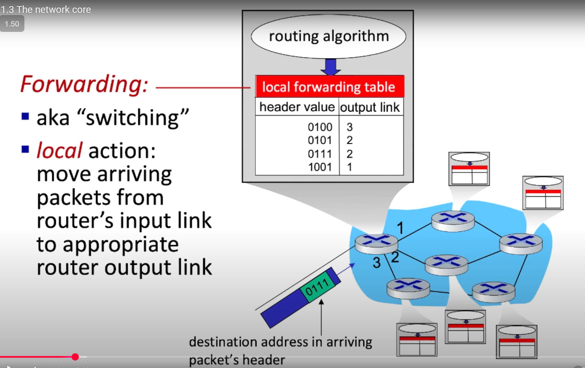
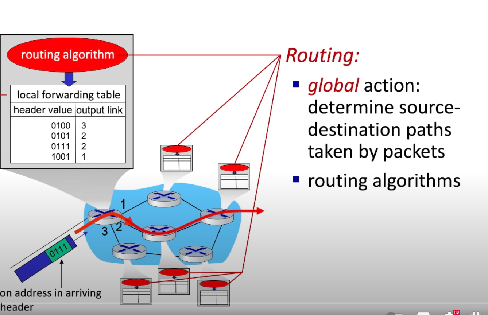
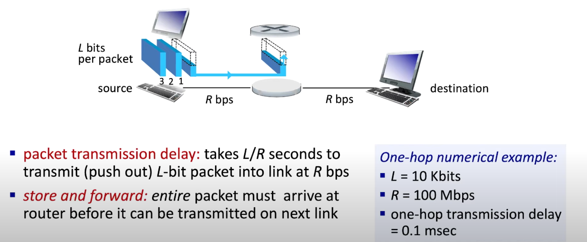
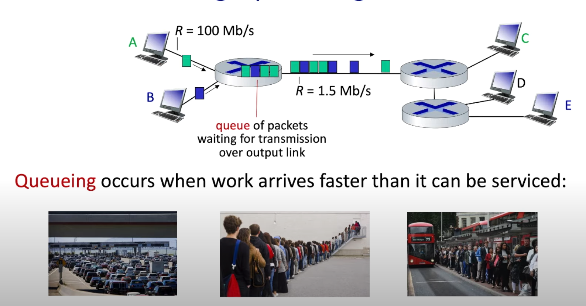
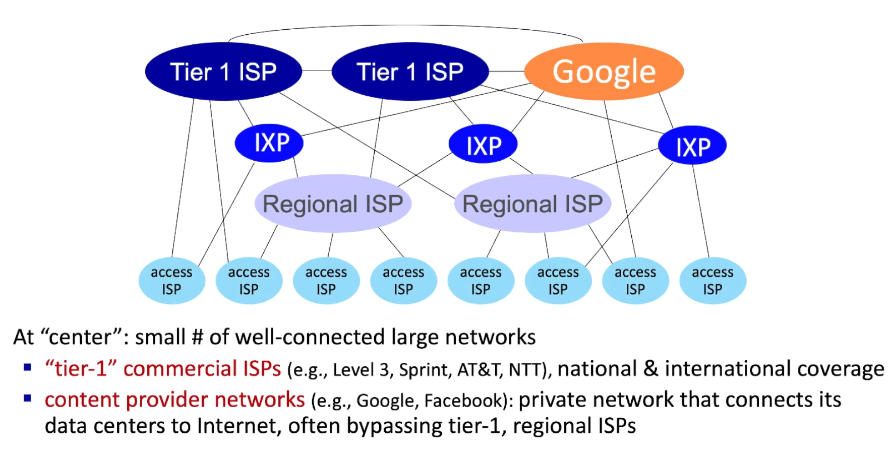
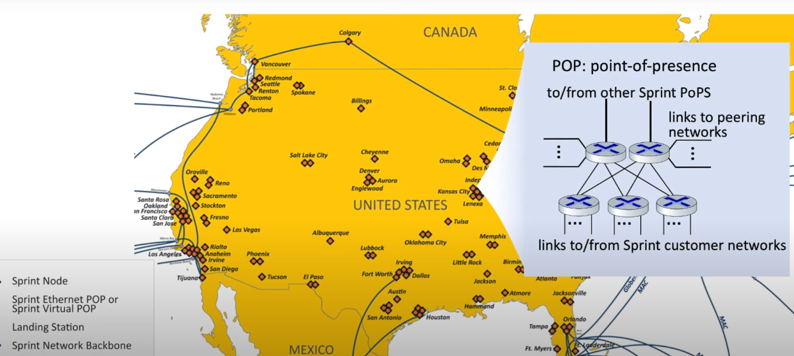

## package switching
#### fowarding

#### routing

#### package transimission delay and store and forward

#### queueing 
source发送的速率arrive rate比transmission rate速度大很多，就会出现queue：

可能出现package被queue导致当前路由器的memory/buffer过载，丢包的状况

## overall view

POP(a set of routers):

