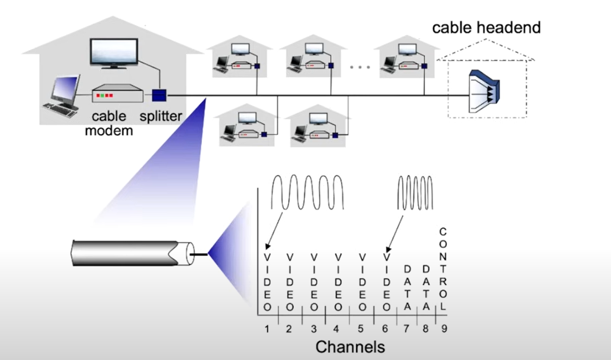
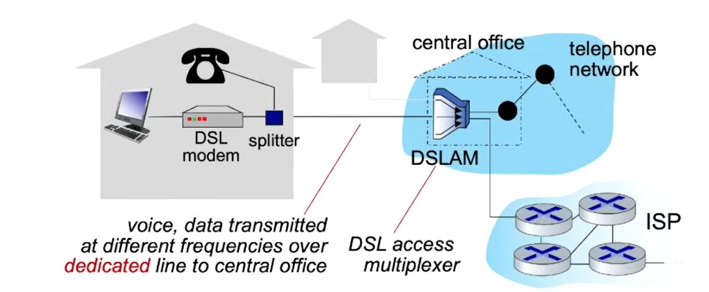
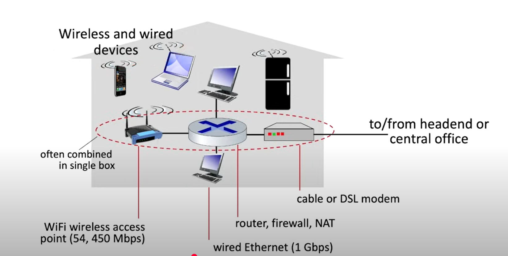

## Access Network: Cable-based access

- Frequency division multiplexing(FDM)
- Hybrid fiber coax(HFC):
    - 下游速度：40Mbps - 1.2Gbs
    - 上游速度：30Mbps - 100Mbps

## Access Network: digital subscriber line(DSL)

- 声音走DSL phone line
- 数据走internet
- 下游速度：24Mbps - 52Mbps
- 上游速度：3.5Mbps - 16Mbps

## Access Network: home network

