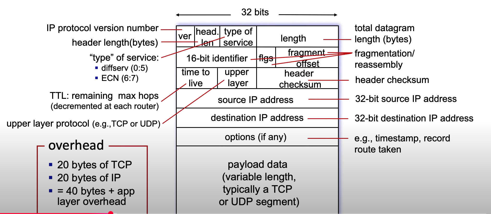
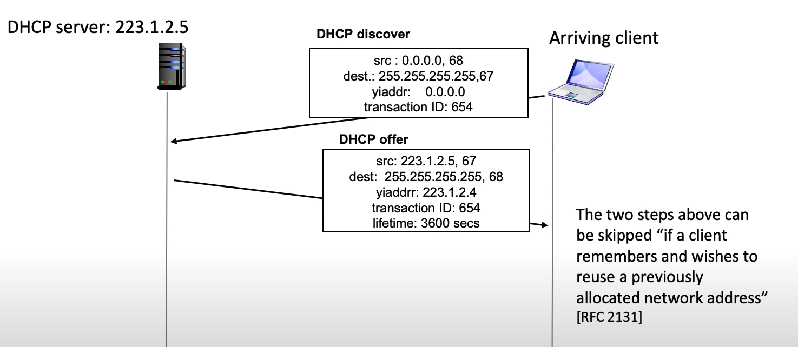
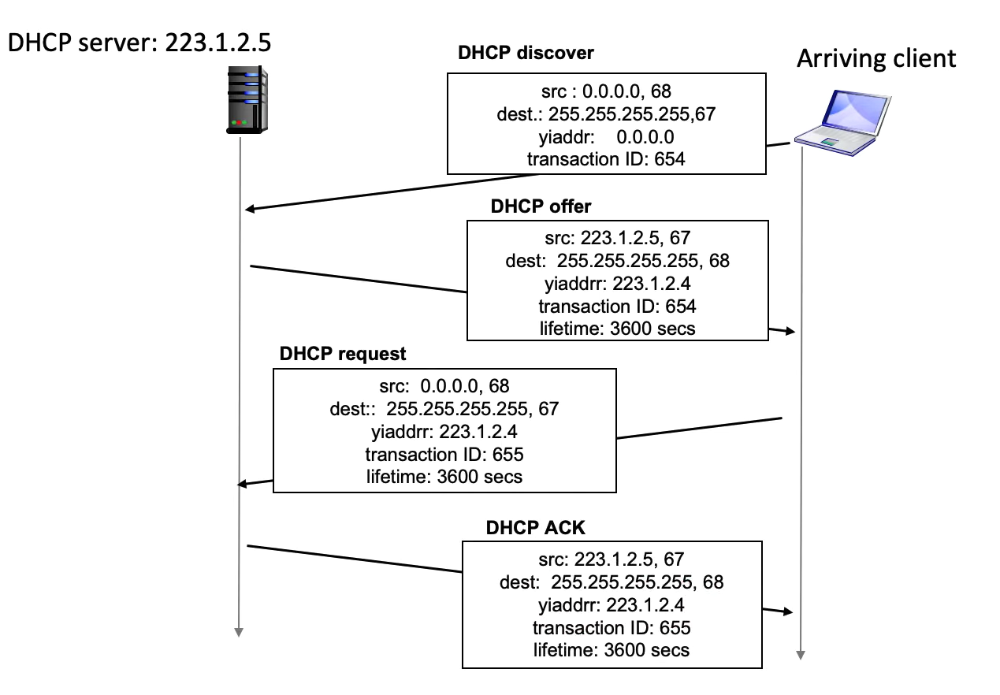
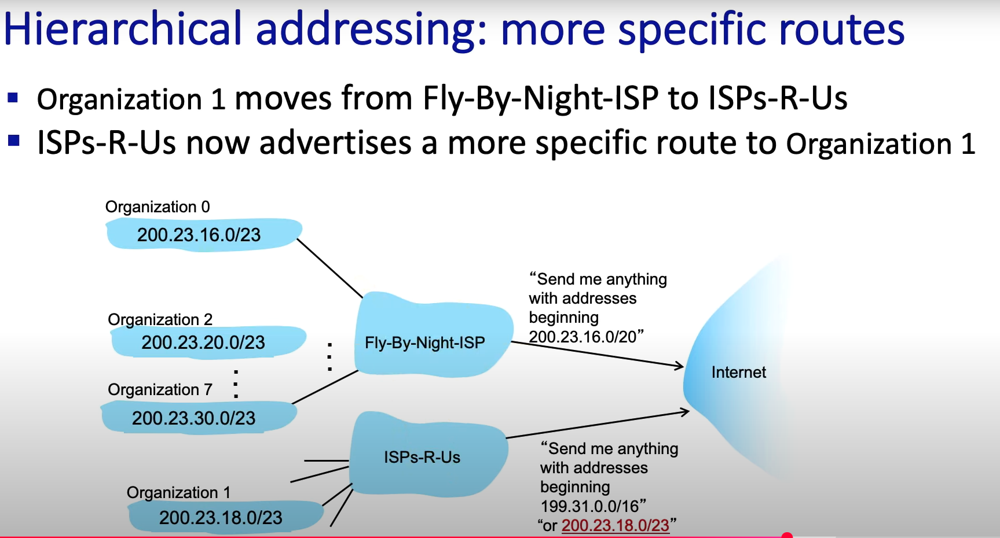

## IP datagrams

> CIDR子网掩码

## DHCP
- DHCP client-server
    - **Server** listen on **67 port**, **client** listens on UDP **port number 68**.
    - Overview:
        - 1-2 steps：

            

        - 3-4 steps：

            

## 层次化地址（Hierarchical addressing）+ 路由聚合（Route aggregation）

- ISP 把多个小网段 /23 汇总成一个大网段 /20 向外宣布，减少路由表条目。
- 实际例子：
    - 互联网上有人访问 Org0 的 Web 服务器（200.23.16.10）：
    1. Internet 的核心路由器看到目标地址在 200.23.16.0/20，转发给 Fly-By-Night-ISP。
    2. ISP 内部查路由表：200.23.16.0/23 在 Org0 → 转发到 Org0 的边界路由器。
    3. Org0 的路由器收到包后，转交给内部服务器。
    - Org0 的员工访问 Google：
    1. Org0 的路由器查表，找不到 8.8.8.8，就匹配默认路由 → ISP。
    2. ISP 查自己的 BGP 表，找到去 Google 的最佳路径。
    3. 包出 ISP，走向 Internet。
    
    