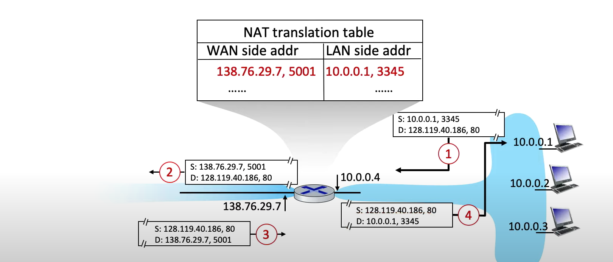
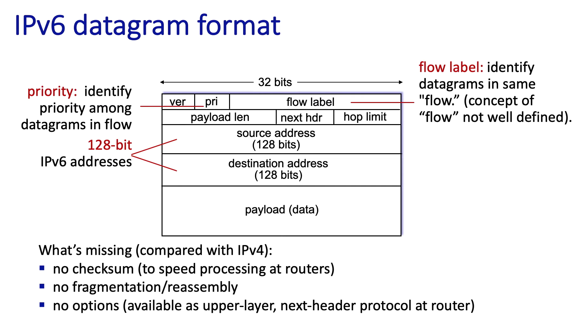

## IPV4 datagrams

> CIDR子网掩码

## DHCP
- DHCP client-server
    - **Server** listen on **67 port**, **client** listens on UDP **port number 68**.
    - Overview:
        - 1-2 steps：

            

        - 3-4 steps：

            

## 层次化地址（Hierarchical addressing）+ 路由聚合（Route aggregation）

- ISP 把多个小网段 /23 汇总成一个大网段 /20 向外宣布，减少路由表条目。
- 实际例子：
    - 互联网上有人访问 Org0 的 Web 服务器（200.23.16.10）：
    1. Internet 的核心路由器看到目标地址在 200.23.16.0/20，转发给 Fly-By-Night-ISP。
    2. ISP 内部查路由表：200.23.16.0/23 在 Org0 → 转发到 Org0 的边界路由器。
    3. Org0 的路由器收到包后，转交给内部服务器。
    - Org0 的员工访问 Google：
    1. Org0 的路由器查表，找不到 8.8.8.8，就匹配默认路由 → ISP。
    2. ISP 查自己的 BGP 表，找到去 Google 的最佳路径。
    3. 包出 ISP，走向 Internet。

    

## 私有IP
1. 10.0.0.0/8: **10.0.0.0 - 10.255.255.255**
2. 172.16.0.0/12: **172.16.0.0 - 172.31.255.255**
3. 192.168.0.0/16: **192.168.0.0 - 192.168.255.255**

## 子网掩码计算
1. 最大可用 IP 数 = **2^(主机位数) – 2**
    - 减去 2 是因为要去掉：网络地址（全 0）,广播地址（全 1）
2. 计算可用范围
    - 比如计算10.10.200.15/20的可用范围：
        - 先通过子网掩码速查表知道/20的块大小为16，并且落在第三位
        - 此时通过将200/16得到12.5，向下取整得到12，再用12*16得到192，则为第三位的起点
        - 得到范围：10.10.192.0 - 10.10.207.255 

    - 参考子网掩码速查表：
    
| 前缀 (/n) | 子网掩码       | 块大小 (Block Size) | 对齐规则（在哪个八位组分块） | 可用地址数 (2^主机位 – 2) |
|-----------|----------------|----------------------|-------------------------------|----------------------------|
| /8  | 255.0.0.0       | 256  | 第二个八位组按 0–255           | 16,777,214 |
| /9  | 255.128.0.0     | 128  | 第二个八位组按 0–127, 128–255 | 8,388,606  |
| /10 | 255.192.0.0     | 64   | 第二个八位组按 0–63, 64–127…  | 4,194,302  |
| /11 | 255.224.0.0     | 32   | 第二个八位组按 0–31, 32–63…   | 2,097,150  |
| /12 | 255.240.0.0     | 16   | 第二个八位组按 0–15, 16–31…   | 1,048,574  |
| /13 | 255.248.0.0     | 8    | 第二个八位组按 0–7, 8–15…     | 524,286    |
| /14 | 255.252.0.0     | 4    | 第二个八位组按 0–3, 4–7…      | 262,142    |
| /15 | 255.254.0.0     | 2    | 第二个八位组按 0–1, 2–3…      | 131,070    |
| /16 | 255.255.0.0     | 256  | 第三个八位组按 0–255          | 65,534     |
| /17 | 255.255.128.0   | 128  | 第三个八位组按 0–127, 128–255 | 32,766     |
| /18 | 255.255.192.0   | 64   | 第三个八位组按 0–63, 64–127…  | 16,382     |
| /19 | 255.255.224.0   | 32   | 第三个八位组按 0–31, 32–63…   | 8,190      |
| /20 | 255.255.240.0   | 16   | 第三个八位组按 0–15, 16–31…   | 4,094      |
| /21 | 255.255.248.0   | 8    | 第三个八位组按 0–7, 8–15…     | 2,046      |
| /22 | 255.255.252.0   | 4    | 第三个八位组按 0–3, 4–7…      | 1,022      |
| /23 | 255.255.254.0   | 2    | 第三个八位组按 0–1, 2–3…      | 510        |
| /24 | 255.255.255.0   | 256  | 第四个八位组按 0–255          | 254        |
| /25 | 255.255.255.128 | 128  | 第四个八位组按 0–127, 128–255 | 126        |
| /26 | 255.255.255.192 | 64   | 第四个八位组按 0–63, 64–127…  | 62         |
| /27 | 255.255.255.224 | 32   | 第四个八位组按 0–31, 32–63…   | 30         |
| /28 | 255.255.255.240 | 16   | 第四个八位组按 0–15, 16–31…   | 14         |
| /29 | 255.255.255.248 | 8    | 第四个八位组按 0–7, 8–15…     | 6          |
| /30 | 255.255.255.252 | 4    | 第四个八位组按 0–3, 4–7…      | 2          |
| /31 | 255.255.255.254 | 2    | 特殊点对点用，不分广播         | 2（点对点） |
| /32 | 255.255.255.255 | 1    | 单个主机地址                   | 1          |

## NAT(Network address translation)
- NAT转换流程：

    

## IPV6 datagrams

