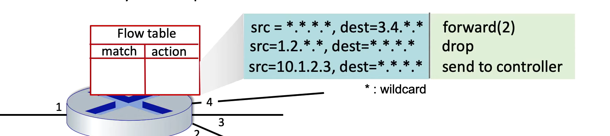
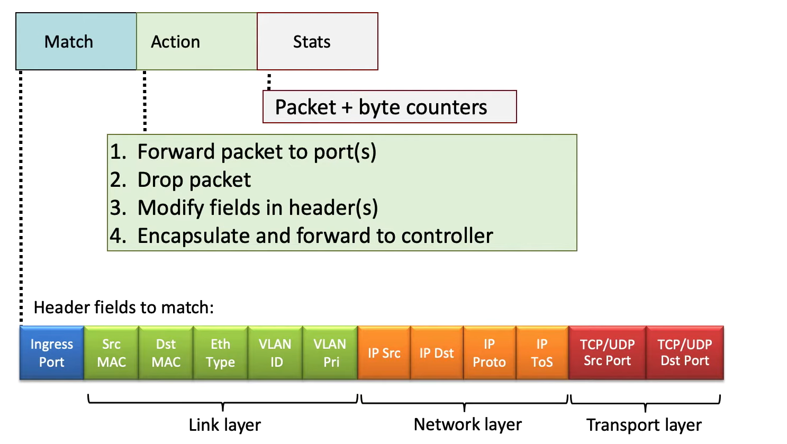
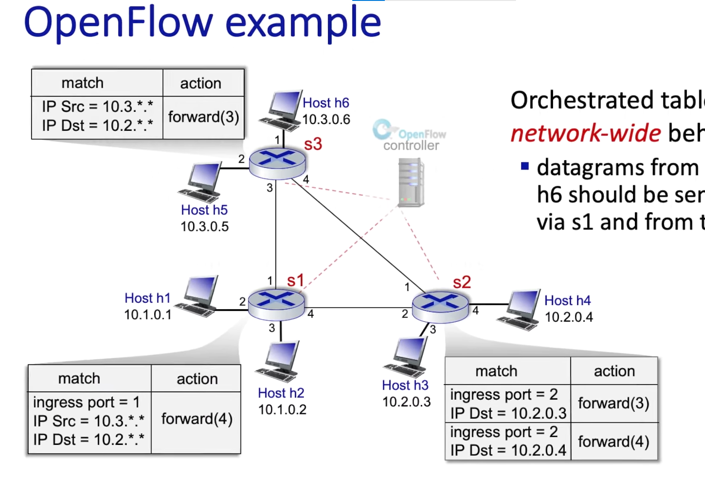

## generalized forwarding
- 把输入端口的包高速转发到正确的输出端口

### Flow table(forwarding table)
#### Open Flow
- 传统路由器的 forwarding table 是基于目的地址的 longest prefix matching
- 现代路由器的 forwarding table基于generalized forwarding，**open flow**就是一个例子:
    - match: 基于多个字段的匹配，比如源地址、目的地址、协议类型、MPLS标签等
    - actions: 可以有多种动作，比如转发到多个端口、修改包头字段、丢弃包等

        

        

    - counters: 记录匹配次数、字节数等统计信息
    - priority: 当多个规则匹配时，优先级高的规则优先应用    

    