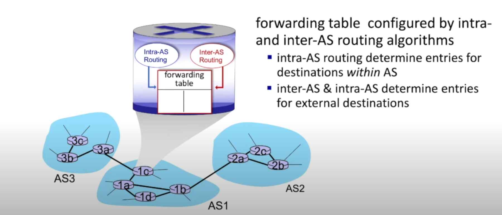
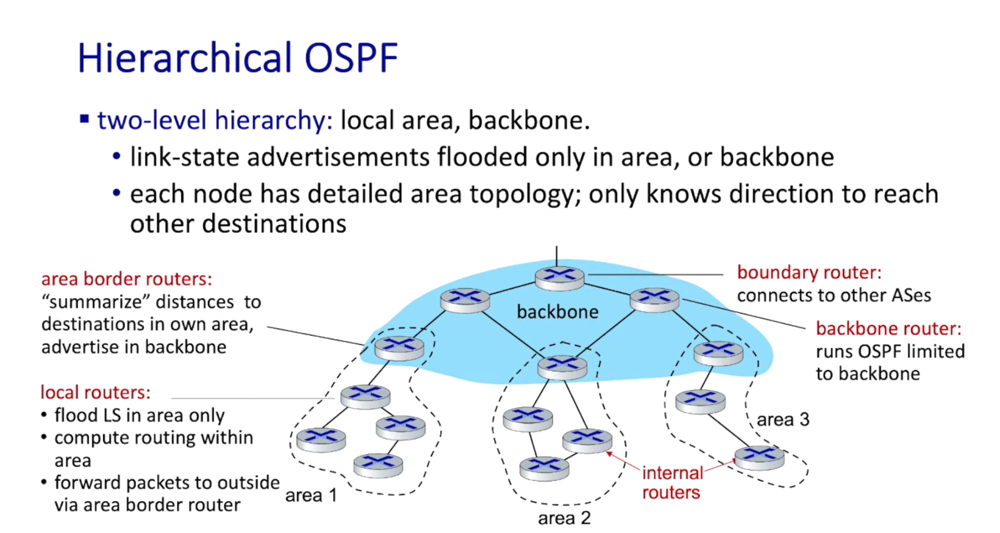

## AS(automous systems自治区)
- **intra-AS routing**（自治系统内路由）
    - 由单一组织管理的网络，如企业网络、校园网络，中国电信，AT&T等。
    - gateway router：在AS的边界上连接不同AS的路由器。
    - 分为infra-AS routing和inter-AS routing:
        - **intra-AS routing**（自治系统内路由）: AS内部的路由选择，由单一组织管理，常用协议有 OSPF、RIP、IS-IS 等。
        - **inter-AS routing**（自治系统间路由）: 不同AS之间的路由选择，通常由不同组织管理，常用协议是 BGP。

        

## OSPF(Open Shortest Path First)
> 和IS-IS基本一样
- 公开（open）：OSPF 是公开可用的协议。
- 经典链路状态（classic link-state）：
    - 每个路由器泛洪（flood）OSPF 的链路状态通告（LSA）到整个自治系统内的所有路由器（直接在 IP 上，而非依赖 TCP/UDP）。
    - 支持多种链路成本度量（例如带宽、延迟）以构造链路代价。
    - 每个路由器维护完整的网络拓扑（full topology），并使用 Dijkstra 算法计算并生成本地的转发表（forwarding table）。
- security: all OSPF messages are authenticated.

    