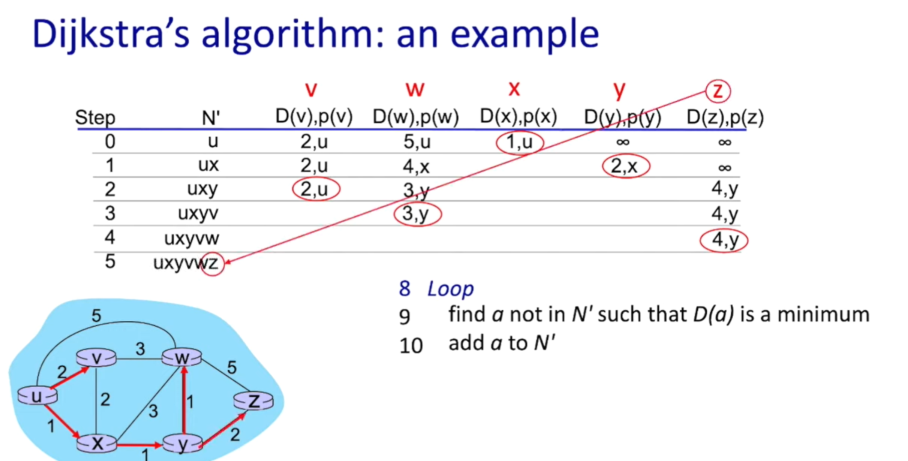

- routing：确定从源到目的地的数据包所走的路径（routing 属于 control plane）。
- forwarding：将到达路由器输入的分组移动到合适的路由器输出端口（forwarding 属于 data plane）。

- Per-router control plane：每台路由器内部都有独立的路由算法组件，这些组件在控制平面中相互交互并维护本地转发表（local forwarding table）。数据包到达时，根据报头中的值查表决定输出端口。

- Software-Defined Networking (SDN) control plane：将控制平面集中在远程控制器（remote controller）。控制器负责计算并下发（install）各个路由器/交换机的转发表，从而实现集中式控制与编排。
## Routing algorithms
- 目标：能计算出从源到目的地的最佳路径，并能动态适应网络拓扑和流量的变化。

    

 - **routing algorithm**
    - **Link-state routing（链路状态路由）**
        - Link-state routing 是一种路由协议的工作方式。在这种方式下，每个**路由器都会定期生成并广播其链接状态信息**，包括其与**邻居路由器的连接状态和成本**（带宽、延迟等）
        - 路由器将接收到的所有链路状态信息收集到一个称为 **"link-state database"**（链路状态数据库）的地方，这个数据库包含了**整个网络拓扑的信息**。
        - 每个节点维护一张完整的网络拓扑图（topology map），并使用 **Dijkstra 算法**计算到所有其他节点的最短路径，从而更新其路由表。
        - **Dijkstra 算法**：

            

            

        - 优点：收敛速度快，适合大规模网络。
        - 缺点：需要较多的内存和计算资源，LSA 广播会产生较大开销。
        - 典型协议：OSPF、IS-IS

    - **Distance-vector routing**（距离矢量路由,被淘汰了）
        - 每个节点只知道与其直接相连的邻居节点的信息，并通过周期性地交换距离向量（distance vector）来更新路由信息。
        - 过程：
            1. 每个节点向其邻居发送包含到各目的地的距离向量。
            2. 每个节点根据收到的距离向量更新自己的路由表。
            3. 重复上述过程，直到路由表收敛。
        - 优点：实现简单，适合小规模网络。
        - 缺点：收敛速度慢，容易出现路由环路和计数到无穷问题。
        - 通过**Bellman-Ford**算法实现。
        - 典型协议：RIP

    - Path-vector routing（路径矢量路由）
        - 类似于距离矢量路由，但每个节点不仅维护到各目的地的距离，还维护到达目的地所经过的路径信息。
        - 过程：
            1. 每个节点向其邻居发送包含到各目的地的路径信息。
            2. 每个节点根据收到的路径信息更新自己的路由表，避免形成环路。
            3. 重复上述过程，直到路由表收敛。
        - 优点：避免了距离矢量路由中的环路问题，适合大型自治系统间的路由选择（如 BGP）。
        - 缺点：实现复杂，路径信息可能较大，增加了通信开销。
        - 典型协议：BGP

