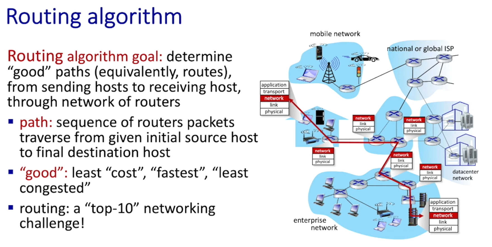
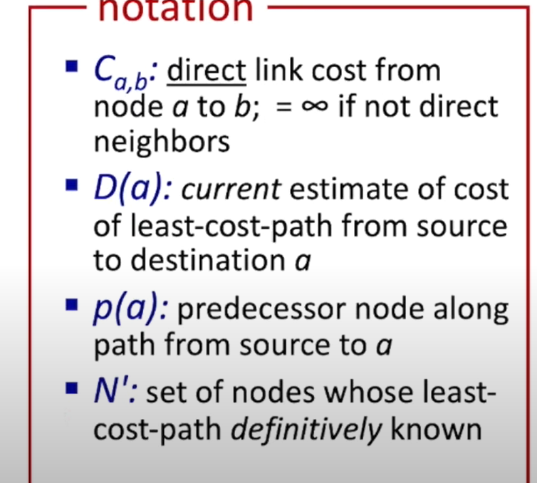

- routing：确定从源到目的地的数据包所走的路径（routing 属于 control plane）。
- forwarding：将到达路由器输入的分组移动到合适的路由器输出端口（forwarding 属于 data plane）。

- Per-router control plane：每台路由器内部都有独立的路由算法组件，这些组件在控制平面中相互交互并维护本地转发表（local forwarding table）。数据包到达时，根据报头中的值查表决定输出端口。

- Software-Defined Networking (SDN) control plane：将控制平面集中在远程控制器（remote controller）。控制器负责计算并下发（install）各个路由器/交换机的转发表，从而实现集中式控制与编排。
## Routing algorithms
- 目标：能计算出从源到目的地的最佳路径，并能动态适应网络拓扑和流量的变化。

    

 - **routing algorithm**
    - Link-state routing（链路状态路由）
        - 每个节点维护一张完整的网络拓扑图（topology map），并使用 Dijkstra 算法计算到所有其他节点的最短路径。
        - 过程：
            1. 每个节点向所有其他节点广播自己的链路状态信息（link-state advertisement, LSA）。
            2. 每个节点收集所有 LSA 并构建完整的网络拓扑图。
            3. 使用 Dijkstra 算法计算到所有其他节点的最短路径，并更新本地转发表。
        - 符号约定（notation）：
            - C_{a,b}: direct link cost from node a to b；如果不是直接邻居则为 ∞。
            - D(a): current estimate of cost of least-cost-path from source to destination a。
            - p(a): predecessor node along path from source to a（到 a 的最短路径上的前驱节点）。
            - N': set of nodes whose least-cost-path definitively known（已确定最短路径的节点集合）。

                

        - 优点：收敛速度快，适合大规模网络。
        - 缺点：需要较多的内存和计算资源，LSA 广播会产生较大开销。

    - Distance-vector routing（距离矢量路由）
        - 每个节点只知道与其直接相连的邻居节点的信息，并通过周期性地交换距离向量（distance vector）来更新路由信息。
        - 过程：
            1. 每个节点向其邻居发送包含到各目的地的距离向量。
            2. 每个节点根据收到的距离向量更新自己的路由表。
            3. 重复上述过程，直到路由表收敛。
        - 优点：实现简单，适合小规模网络。
        - 缺点：收敛速度慢，容易出现路由环路和计数到无穷问题。

    - Path-vector routing（路径矢量路由）
        - 类似于距离矢量路由，但每个节点不仅维护到各目的地的距离，还维护到达目的地所经过的路径信息。
        - 过程：
            1. 每个节点向其邻居发送包含到各目的地的路径信息。
            2. 每个节点根据收到的路径信息更新自己的路由表，避免形成环路。
            3. 重复上述过程，直到路由表收敛。
        - 优点：避免了距离矢量路由中的环路问题，适合大型自治系统间的路由选择（如 BGP）。
        - 缺点：实现复杂，路径信息可能较大，增加了通信开销。

