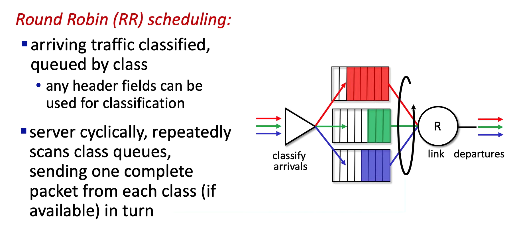
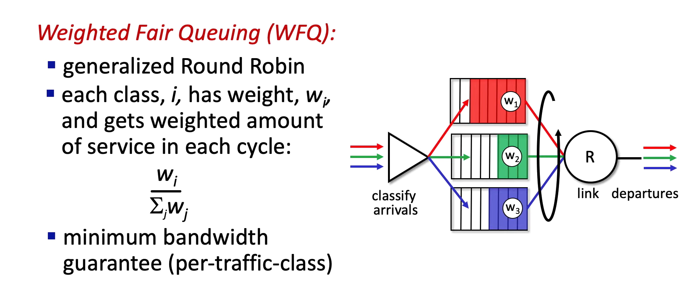
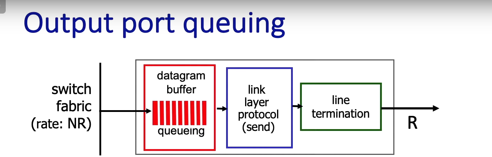

## Router
- generic router architecture:
    - control plane
        - **Routing Processor路由处理器**（软件）
        - **路由选择**（运行 OSPF、BGP 等协议）,**维护转发表** (Forwarding Table),**网络管理**（策略控制、ACL、防火墙规则等）。
    - data plane
        - **High-speed Switching Fabric高速交换结构**（硬件）
        - 把输入端口的包高速转发到正确的输出端口
    

- forwarding：
    - **Destination-based forwarding基于目的地址的转发**
        - traditional ways to divide to different subnet:

        

        - longest prefix matching最长前缀匹配:
            - 通常使用TCAMs(ternary content addressable memories)
                - 一种特殊的硬件存储器，用于高速匹配，Cisco Catalyst 路由器的 TCAM 可以存 上百万条路由表项。

        

- swithing fabric:
    - Memory-based switching（基于内存的交换）:
        - 所有数据包先写入路由器内存，再从内存读出到输出端口，速度受限于内存的读写速度。

        

    - Bus-based switching（基于总线的交换）：
        - 输入端口通过一条共享的总线把包送到输出端口。总线带宽有限，多个输入并发时容易冲突。(比memory少了一步需要写入内存的写操作)
        > 比如Cisco 5600 的总线带宽 32 Gbps，对于普通企业接入网络来说已经够快

        

    - Interconnection Network（互联网络式交换）：
        - 内部有一组交叉点（crossbar switch），支持多个输入同时连接到多个输出。支持更高吞吐量，常用于高性能核心路由器。

        

- input port queuing
    - Head-of-the-line(HOL) blocking
        - 交换机（switch fabric）需要把输入端口的包转发到输出端口，每个输入端口有一个队列（先进先出 FIFO）。
        - 比如下面底部队列里的 绿色包本来可以发往绿色端口，但它被红色包卡住了，这就是HOL blocking。

        
    
- Output port queuing
    - Drop policy:如果没有足够buffer，应该丢哪个包
        - Tail Drop（丢新来的）
        - Random Early Detection (RED)（随机丢）
        - 优先级丢弃（低优先级先丢）

    - Scheduling discipline:需要有一个schedule机制决定queue中哪个包应该先送
        - FIFO（先进先出）
        - Priority Queuing（高优先级先发）
        - Round Robin Scheduling:

            

            - Weighted Fair Queuing (WFQ，加权公平队列是更常用的RR策略)
                - 如果下面的权重是w1:w2:w3=3:2:1那么在一个轮次里：
                    - 红队列可以发 3 个包
                    - 绿队列发 2 个包
                    - 蓝队列发 1 个包

            
    
    