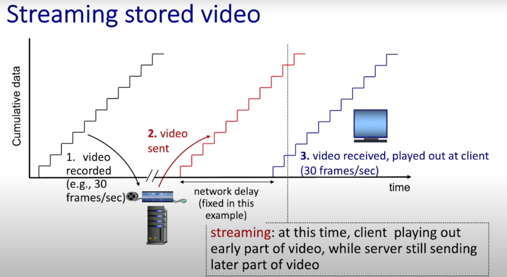
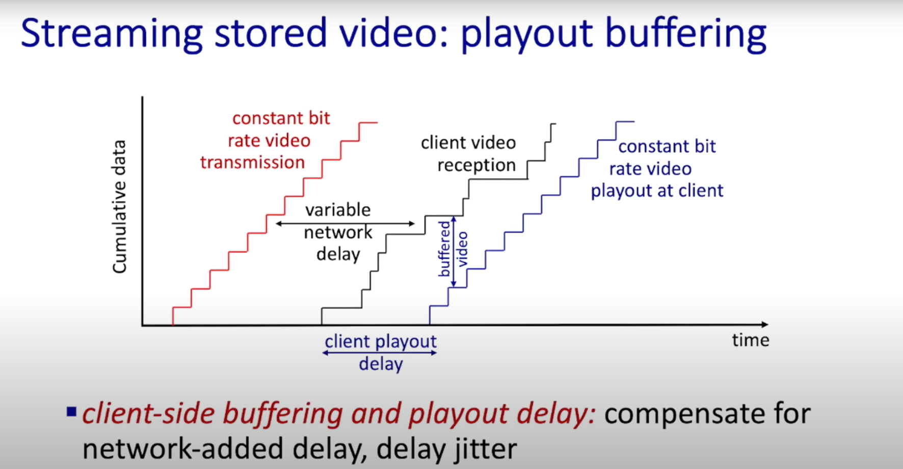
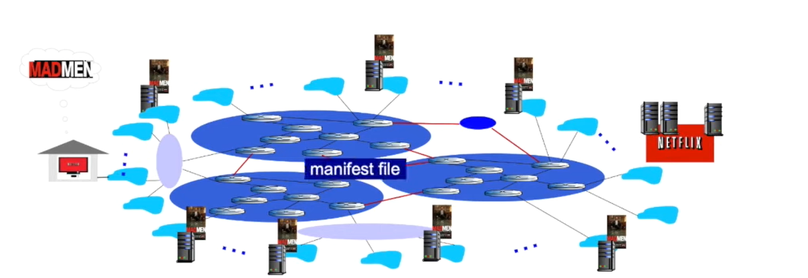

## 传输视频
> streaming video其实就是连续的图片，比如24张图片/秒组成的视频，那视频从网络中传递，就是将一张张图片分成一个pixel，也就代表一个bit，在代码中，一个bit如果是相同颜色，就可以重复使用同一个元素，加快传输速度，并且如果下一帧的图片和上一帧的图片很相似，则可以通过只传输delta change的pixel加快传输速度。
#### CBR
- constant bit rate: video encoding rate fixed 
#### VBR
- variable bit rate: video encoding rate changes as amount of spatial, temporal coding changes

#### streaming video
理想状况，CBR传输，速度保持恒定不变：

非理想状态，有延迟，则是VBR：

- 网络先把数据传过来 → 放进缓冲区 (buffer)

- 客户端等缓冲了一定量（client playout delay），再以稳定速率播放

- 这样可以避免因为网络抖动 (jitter) 或延迟变化导致的卡顿。

- 比如你点开一个视频，它会先“加载圈几秒钟”，这就是在做 client playout delay。

#### Dash
- Dynamic Adaptive Streaming over HTTP, 根据用户的 网络带宽 和 设备性能，动态调整视频的质量（码率），保证不卡顿。

- Server:
    - 视频文件被切成很多小片段（chunk），每个 chunk 可能是 2~10 秒的视频。
    - 每个 chunk 都有多种版本（高码率 / 低码率）,比如：720p、480p、240p 都有对应的文件。
    - 不同清晰度的 chunk 存在不同的文件里。
    - 这些文件会分发到全球的 CDN 节点，离用户更近，减少延迟。
    - 有一个清单文件（manifest），里面存着 所有 chunk 的 URL 和对应的码率。客户端一开始会下载这个文件，知道不同清晰度的 chunk 在哪里。

## CDN
- stores copies of content at CDN nodes
1. 客户端找NETFLIX要某部视频的mainfest file
2. 客户端根据mainfest file以及当前网络抖动和速率去判断具体要连接哪一个服务器下载视频

