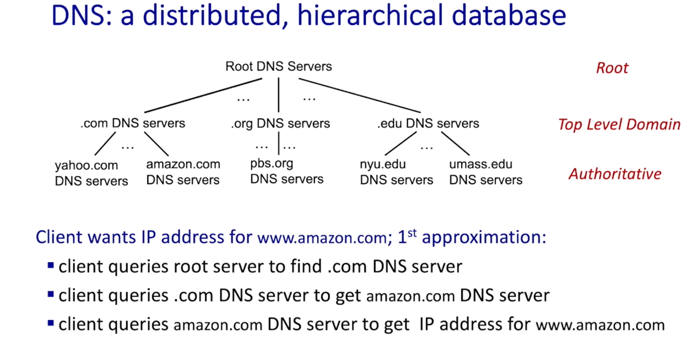
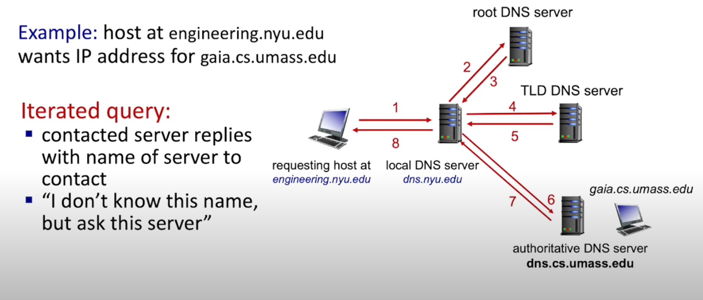
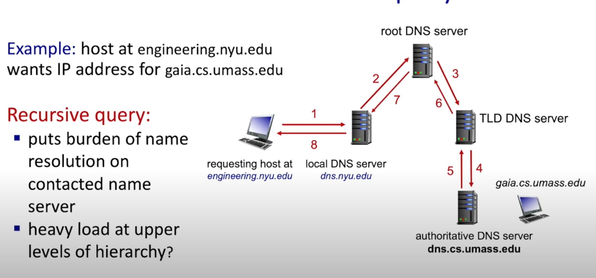
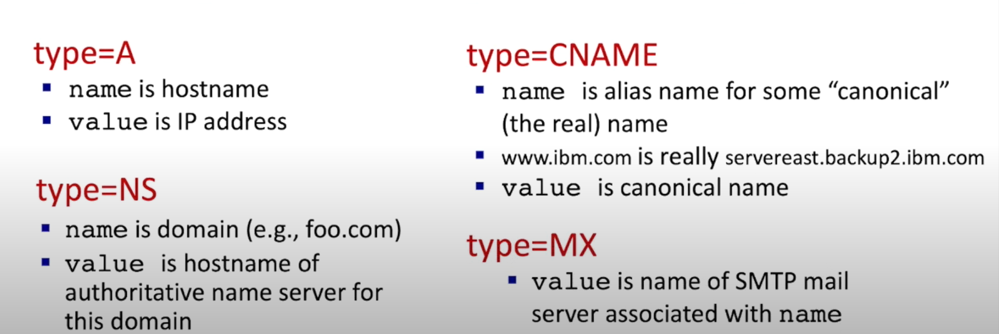

## DNS:Domain Name System
- DNS是一个分布式的和分层的数据库

    

- iterated query

    

- recursive query

    

- caching DNS information 
    - cache entries timeout after some time(TTL)

## DNS records
- distribution database store resource records(RR)
    - RR format:(name, value, type, ttl)
    - four types of DNS records:

        