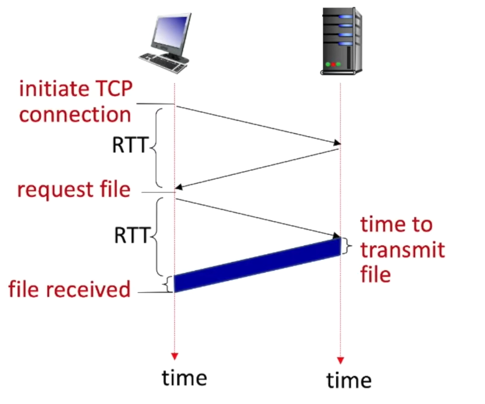
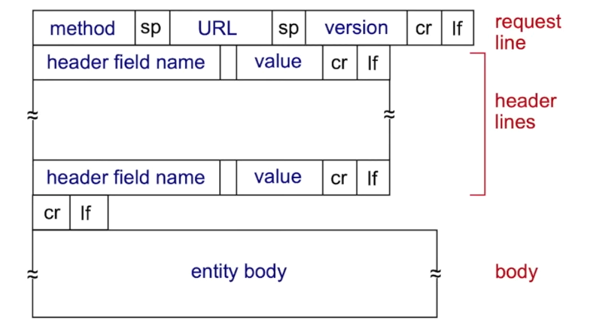
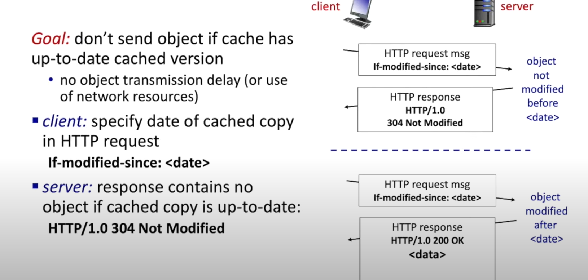
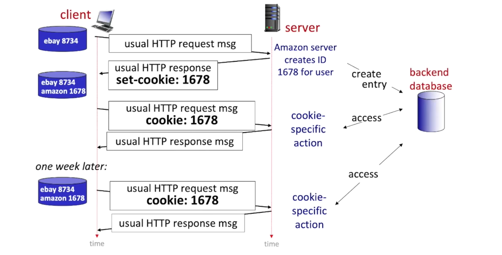

## HTTP
#### Non-persistent HTTP
- at most one object sent over TCP connection
- 2RTT + file transmission time
#### persistent HTTP
- multiple objects can sent over single TCP connection
- Server leaves connection open after sending response
- as little as one RTT for all the referenced objects

#### RTT
- time for a small packet to travel from client to server and back

    

## Two types of http messages
#### Request
1. Request line
2. Header lines
3. Body

3. 四种request method类型：
    - post
    - get
        - conditional get:

            
            
    - head
        
        只要headers但不需要真的return object
    - put
        
        上传新文件
#### Response
1. Status line
2. Header lines
3. Body
4. Status code:
    - 200 OK
    - 301 Moved permanently
    - 400 Bad request
    - 401 Not Found
    - 505 HTTP Version Not Supported

## Cookies
- Web sites and client browser use cookies to maintain some state between transactions
- can be used for:
    - authorization
    - shopping cart
    - recommendation
    - user session state
1. cookie header line of HTTP response message
2. cookie header line in next HTTP request message
3. cookie file kept on user's host, managed by user's browser
4. backend database at website

