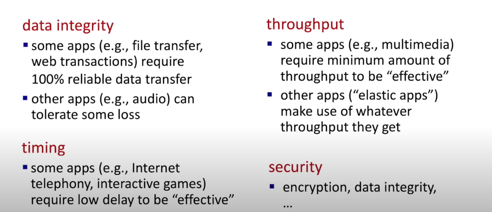
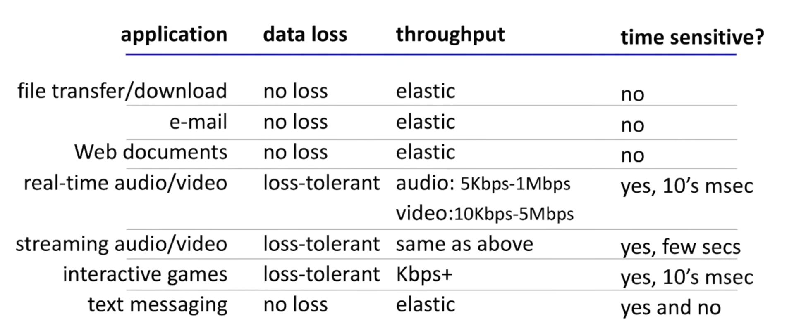
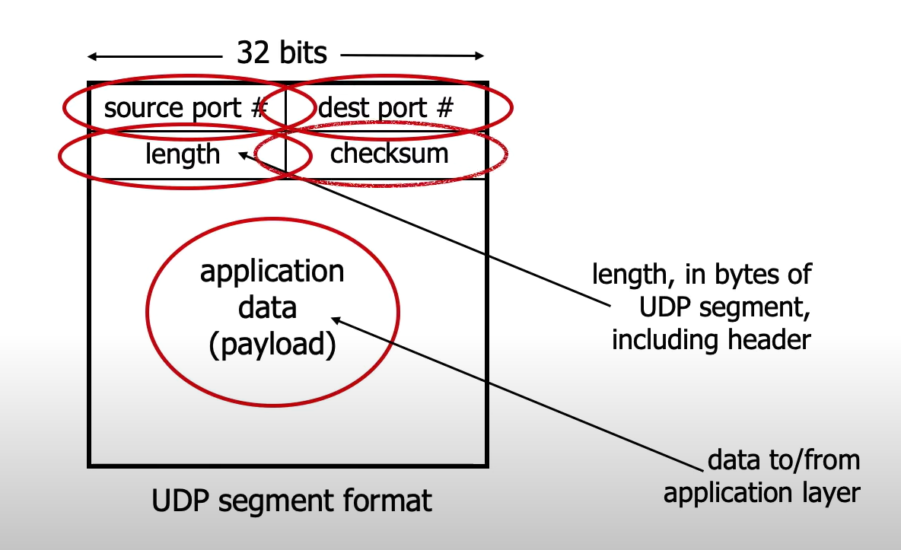
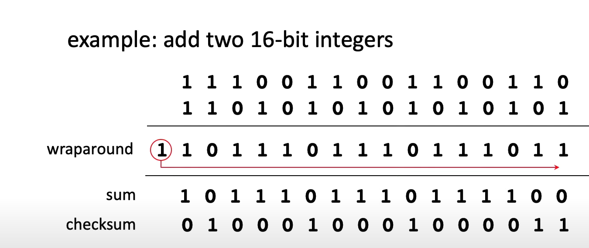

## transport layer会提供什么    
#### data integrity
#### timing 
#### throughput
#### security

## tcp
#### reliable transport
#### flow control
#### congestion control
#### connection-oriented
#### TLS
在tcp上面，还有一层tls(transport layer security)
- 提供加密，数据完整性和end-point authentication
## udp
#### unreliable data transport

