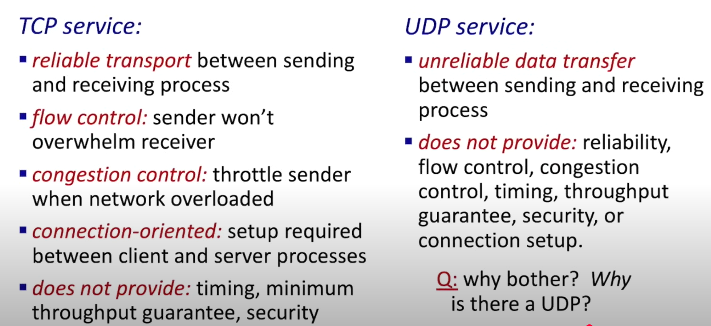
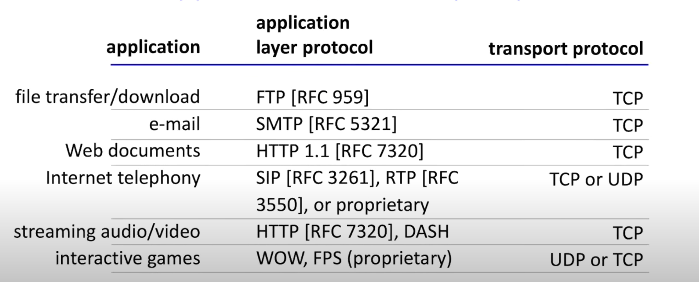
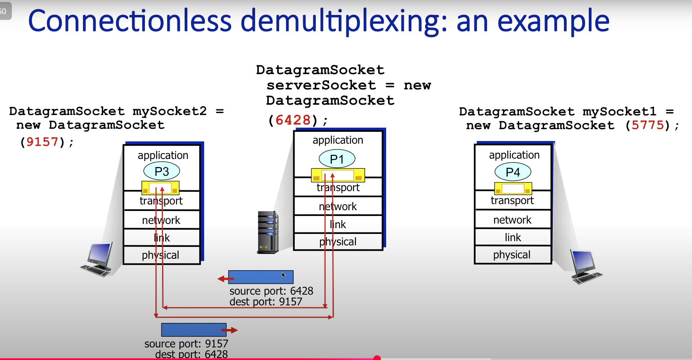

## transport layer会提供什么    
#### data integrity
#### timing 
#### throughput
#### security

## tcp
#### reliable transport
#### flow control
#### congestion control
#### connection-oriented
#### TLS
在tcp上面，还有一层tls(transport layer security)
- 提供加密，数据完整性和end-point authentication
## udp
#### unreliable data transport

## multiplexing 
- 
## demultiplexing
- demultiplexing（分用）：同一台机器上很多应用，但通过端口号把报文分给不同进程。
- UDP:
    - 没有像 TCP 那样的三次握手,服务端只需要 **一个 socket** 来绑定端口，它只靠“**目标端口号**”来决定数据交给哪个应用进程。

    

- TCP:
    - 服务端首先也有一个 listen socket（比如 80 端口）。
    - 但当客户端发起连接后，内核会为每个客户端**建立一个新的 connection socket**。
    - 每个 connection socket 对应一个 TCP 连接（**四元组唯一标识(srcIP, srcPort, dstIP, dstPort )**）。应用通过 accept() 拿到这些 connection socket，然后一一处理。

    