## Go-Back-N in action的重传机制
- 超时重传时，发送方必须重传 pkt2 后的所有分组（pkt2, pkt3, pkt4, pkt5 …）。
- 接收方只会重复发送 “我还在等 ack2”。
- 接收方没有缓存：如果 pkt2 丢了，那么之后到达的 pkt3、pkt4、pkt5 全部丢弃。
- 接收方逻辑简单，不需要缓存乱序分组。但浪费带宽，因为后面正确到达的分组也要被丢弃、重传。

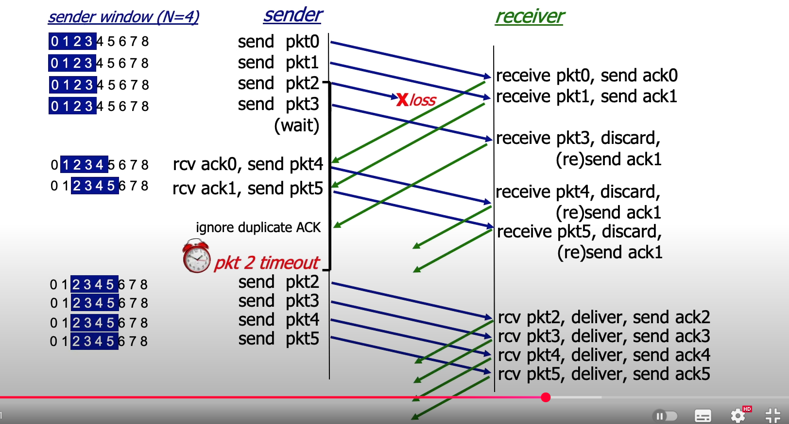

## Selective Repeat in action重传机制
- ACK 是单独确认的：每个包都有自己的 ACK（ack0, ack1, ack3, ack4, ack5 …）。
- 超时重传时，只重传丢失的分组（pkt2），而不会重传已经正确到达的（pkt3-5）。
- 接收方有缓存：即使丢了 pkt2，接收方仍然把 pkt3、pkt4、pkt5 收下，放在 buffer 里。
- 吞吐量高，带宽利用率好。适合高丢包/高延迟的网络。
- 需要接收端维护 buffer，逻辑更复杂。

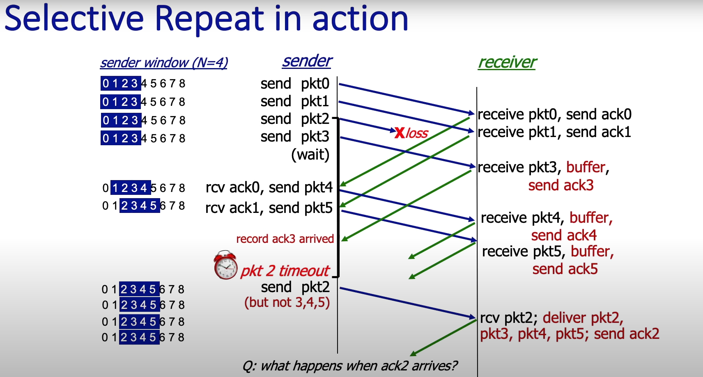

## TCP
- 特点：

    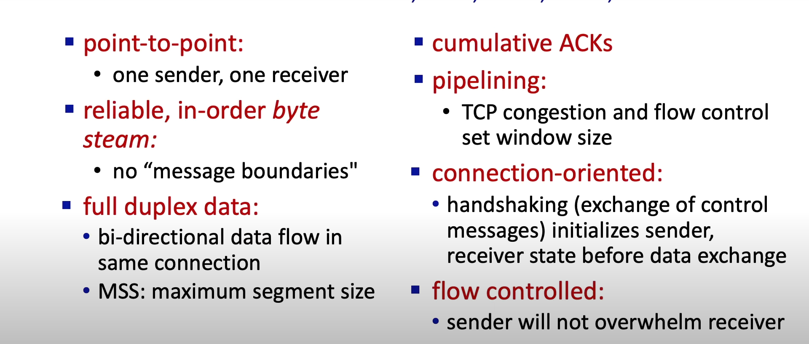

- TCP报文长这样:

    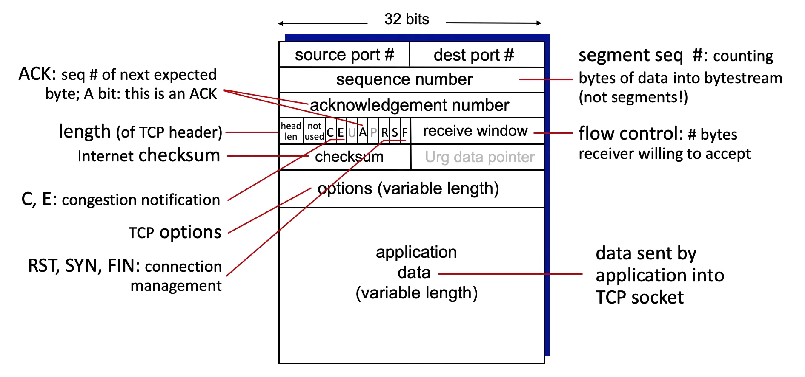

#### TCP reliable and cumulative ACKs相关知识
- 如何计算**Time out interval**时间
>先计算出estimated RTT

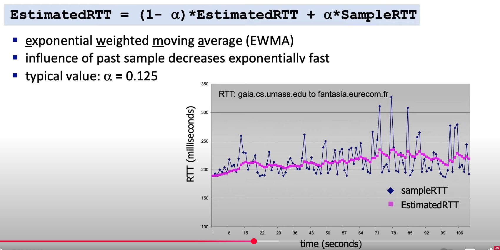

>再计算重传的timeout时间

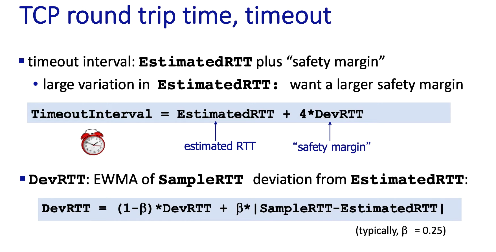


- receiver的动作：
    
    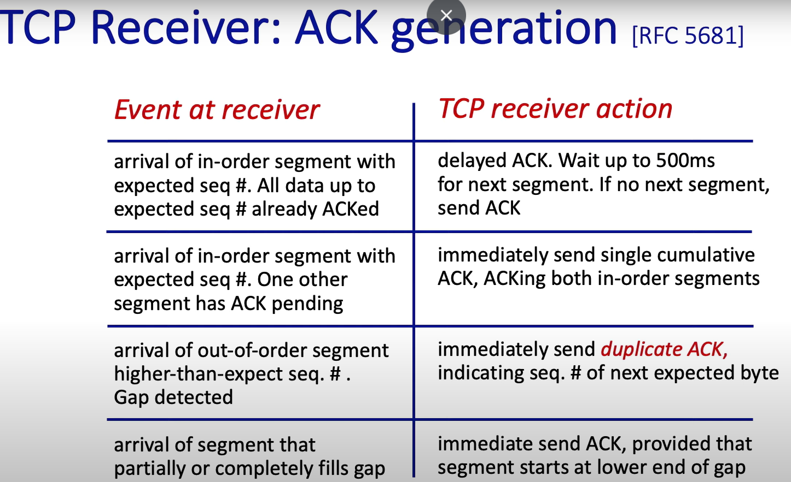

    1. **按顺序到达**:
    
        发送方发送Seq=1000–1999的数据，接收方**不会立刻发 ACK**，而是等一等（比如 500ms），看看会不会一起收到下一个段（Seq=2000–2999）。如果收到了，就可以一次 ACK 到 3000；如果没收到，就在 500ms 内发一个 ACK=2000。
    2. **还是按顺序，但已有未发的 ACK**:
    
        接收方刚刚**收到了 Seq=1000–1999**，准备延迟 ACK（等 500ms），**又收到了 Seq=2000–2999**，**会立即发**一个累计 ACK=3000，把两个段一起确认。
    3. **乱序包，比期望的更靠后(cumulative ack)**: 

        接收方**期望 Seq=1000–1999**，但没收到,结果先**收到了 Seq=2000–2999（更靠后）**,接收方立即发一个 **重复ACK(cumulative ack) 号 = 1000** (duplicate ACK)，告诉发送方“我还在等 1000”。

    4. **补上缺口**:

        本来**缺了 Seq=1000–1999**，结果后续 Seq=2000–2999、3000–3999 都收到了并缓存着,现在**终于收到了 Seq=1000–1999**，接收方立即**发一个 ACK=4000**，因为现在已经可以顺序交付到 3999 了。


#### Flow Control and connection management
- flow control
    - **RcvBuffer** = 接收方的“收纳箱”, **buffered data**（蓝色）这些数据还没来得及交给上层应用,剩下一部分空位 = **free buffer space**也就是**rwnd（receive window）**表示最多还能再收多少字节。
    - 接收方告诉发送方（advertise）：“我现在的空位是 X 字节”写在 **TCP 头里的 rwnd**字段。
    - 发送方根据 rwnd 限制自己未被 ACK 的数据量，如果 rwnd = 4096 bytes，那发送方最多只能发 4096 字节“在路上”

    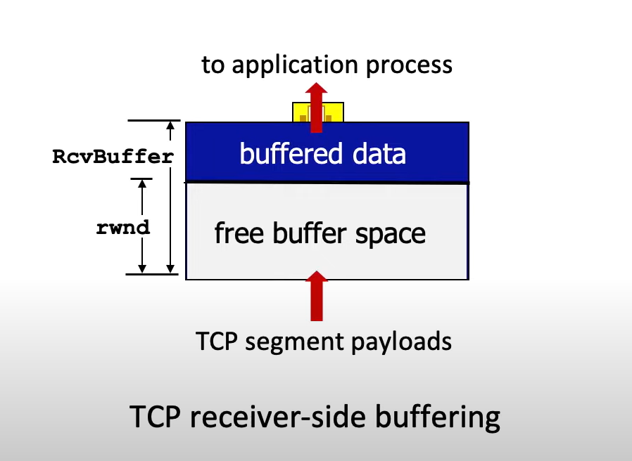

    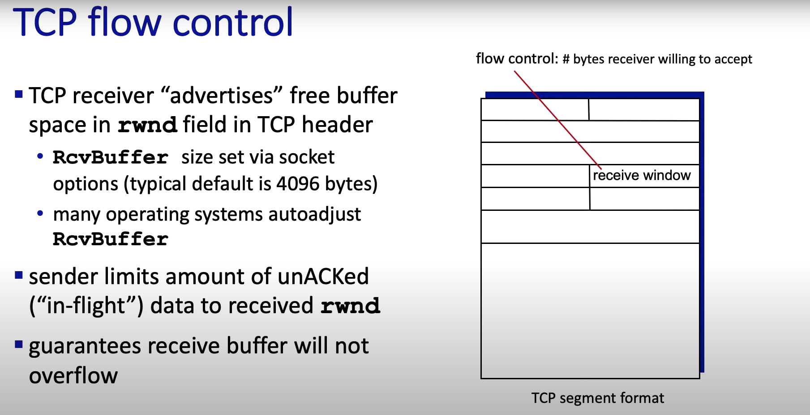

- TCP三次握手：
1. Client 调用：clientSocket.connect((serverName, serverPort)), TCP 选择一个初始序列号（Seq = x）,发给 Server 一个 SYN 报文
    ```ini
    SYN = 1, Seq = x
    ```

2. Server 监听：serverSocket.listen()，收到 Client 的 SYN 后，自己也选择一个初始序列号（Seq = y）发回一个 SYN+ACK 报文：
    ```ini
    SYN = 1, Seq = y
    ACK = 1, AckNum = x + 1
    ```
3. Client 收到 SYN+ACK，回应 ACK, 发回一个 ACK 报文：
    ```ini
    ACK = 1, AckNum = y + 1
    ```

4. Server 收到最后 ACK, Server 收到 Client 的 ACK。

> 整体过程：服务端**LISTEN**，客户端发出 SYN此时状态为**SYN SENT**，服务端收到了SYN，也发出了 SYN+ACK此时状态为**SYN RCVD**，最终服务端**ESTABLISHED**。

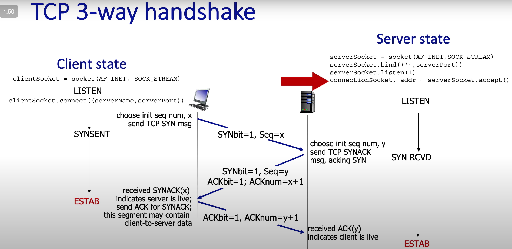

#### Congestion control
> flow control更针对的是一个sender发送太快，congestion control更加针对的是整体用户的发送速度导致的整个link瘫痪或者频繁丢包的情况

- congestion的坏处

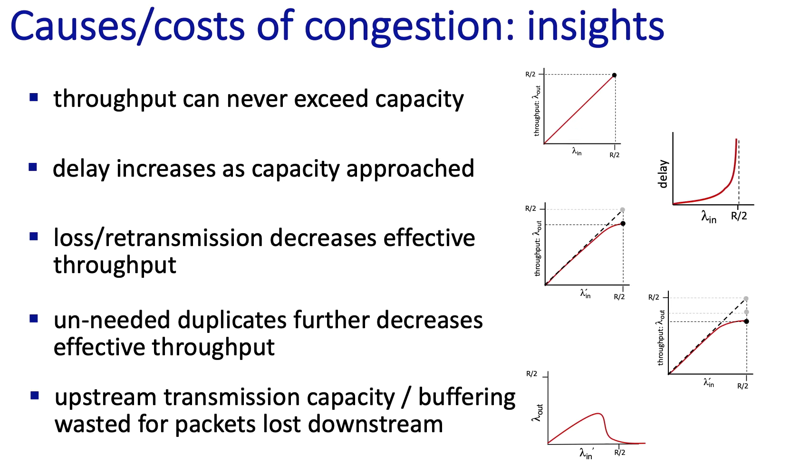

- 解决办法：
    - **End-end congestion control**
        - 发送方需要自己去“推测”网络拥堵情况，比如是否有丢包或者延迟变大。
        - AIMD(Additive Increase Multiplicative Decrease) :
            - 每收到一个 ACK，就小幅度增加拥塞窗口（cwnd）。
            - 一旦检测到丢包（= 网络拥塞信号），就把 cwnd 乘以一个因子（通常是减半）。

            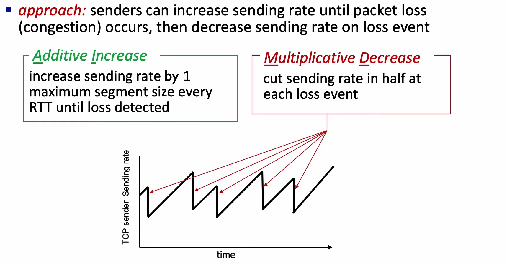

        - 具体的实现AIMD的版本有：
            - Tahoe(loss-based):**cwnd 线性增加**（Additive Increase）。一旦丢包 → **cwnd 直接减为 1**（乘性减少到最小值）。
            - Reno(loss-based):丢包时不是直接减到 1，而是 **cwnd 减半**，Reno 在 Tahoe 的基础上优化了快速重传/快速恢复。
            - **CUBIC(loss-based)**:但加性部分不再是线性增加，而是用**三次函数（cubic 函数）**让带宽利用更高，收敛更快，所以 CUBIC = AIMD 的改进版（更平滑、更适合高带宽-长延迟链路）。

                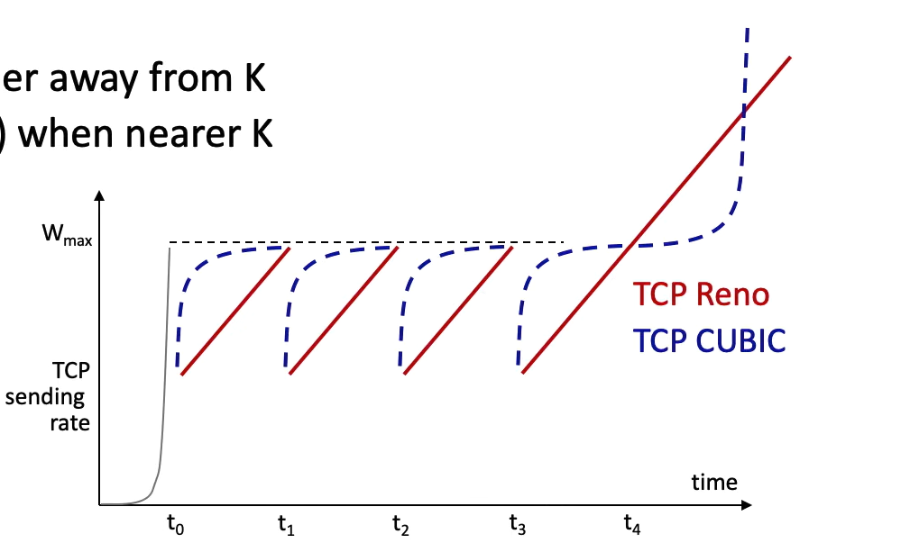
        
        > 早期还有Vegas是通过延迟驱动，通过判断RTT来加速和减速。同样还有现在谷歌用的BBR的模型驱动，通过瓶颈带宽和最小 RTT 的估计值，保持发送速率 ≈ 带宽 × RTT，让管道“刚好填满，不积压”。

    - **Network-assigned congestion control**
        - 网络设备（路由器）会直接给发送方反馈。
        - ECN (Explicit Congestion Notification)：TCP/IP 扩展，路由器在 IP 头打一个标志，告诉发送方“不要再发太快”。

        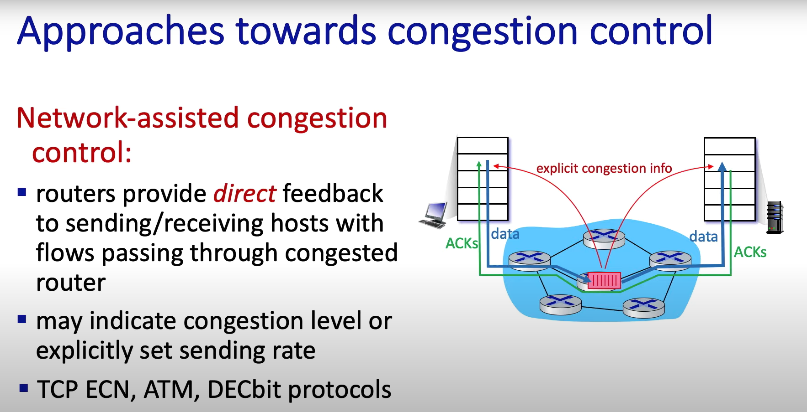
