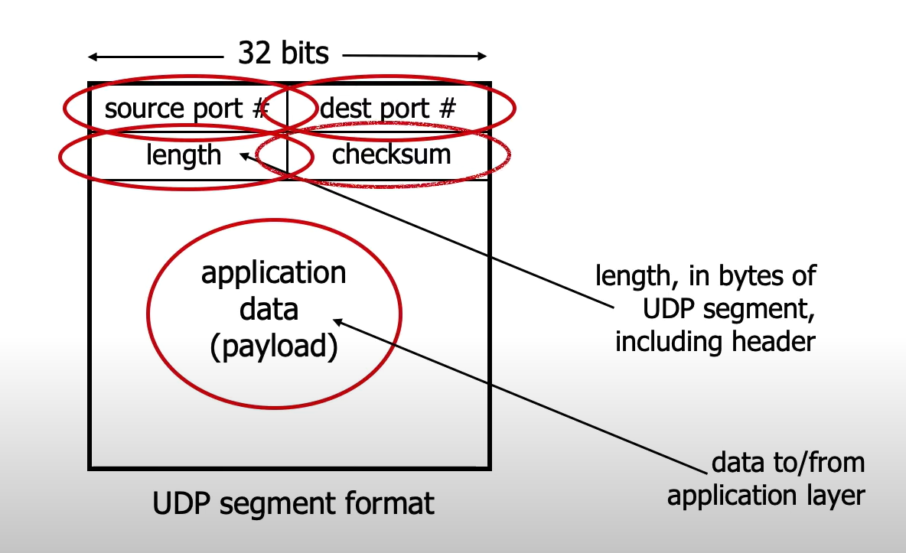
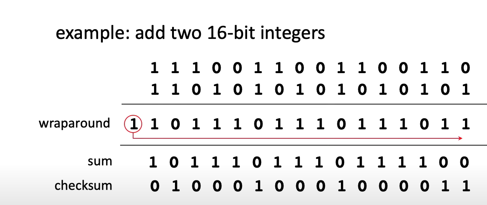
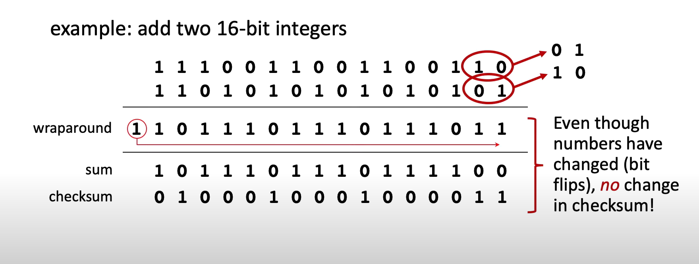

## UDP
- No connection established
- Simple and small header size.
- No congestion control, best effort can blast away as fast as desired.
- Uses: streaming multimedia apps, DNS, SNMP, HTTP/3

#### UDP segement header

- checksum，具体计算方式如下：

    

    但如果有两对bit互换了位置(bits flip)，checksum任然会一样，但实际上内容已发生改变：

    

#### 