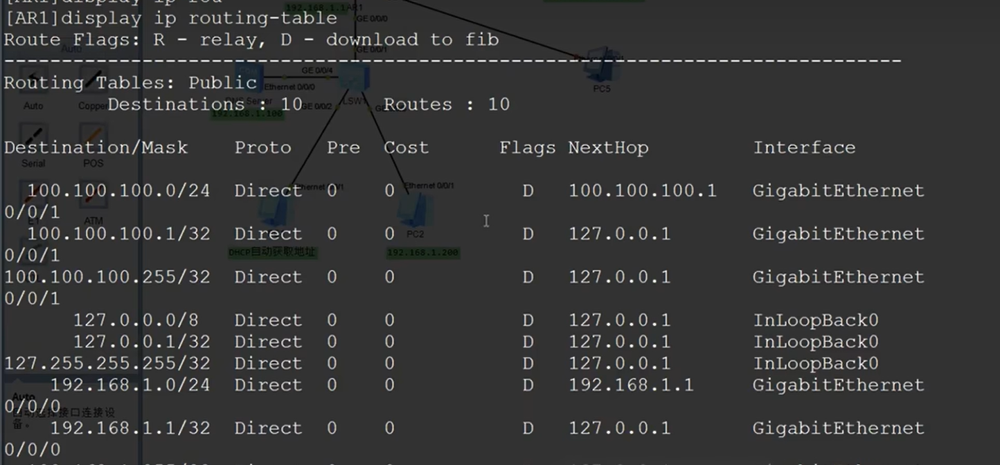
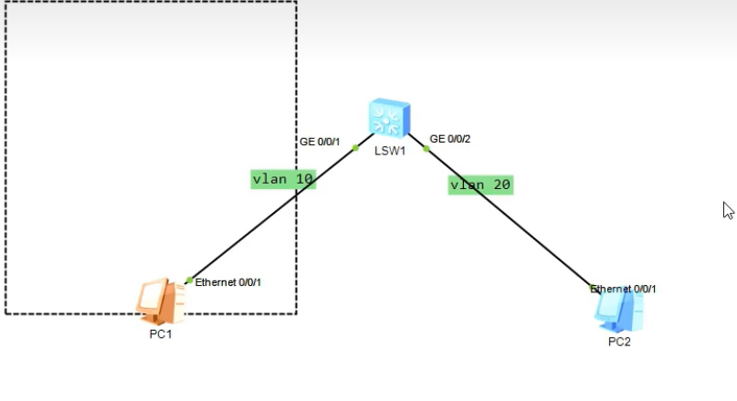

## 网络重要组件
1. 交换机：
    - 使相同网段下不同主机之间能通信
    - 交换机接口主要是两种：
        - access：连接终端，电脑，打印机
        - trunk：连接其他交换机

2. 网关(大部分路由器都是包含网关)：
    - 用来连接不同的网段
    - 云计算中，可以相同子网下的不同网段之间的通信，是通过网关/路由器
    - 网关会通过路由表(routing-table)去判断包应该去哪一个网段

    > 比如一个网关可能连接很多个网段

    

    > 通过iptable实现

    

3. CDN()：
    - 让不同的人访问相同域名时，返回不同的IP地址
## 协议区别
1. TCP：
    - 适合传文件，完整性要求高，对延迟不敏感，对每个包做确认处理，三次握手
    - 比如电子邮件，或者更新游戏

2. UDP：
    - 速度快，不会确认是否到达，允许丢包

## 网络安全
1. Vlan(虚拟局域网)：
    - 通过网络隔离解决网络隐患的覆盖率。
    - 交换机中创建Vlan，并将对应接口放入vlan中
    > 相同网段的IP如果在不同vlan，默认也是不通的
    
    
2. acl：
